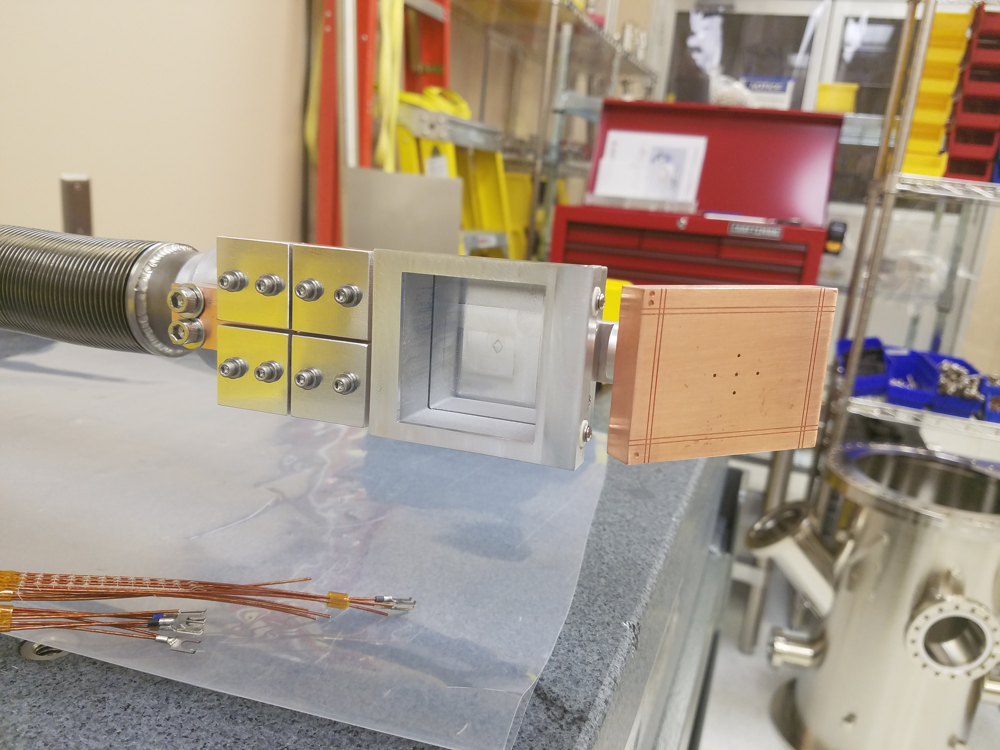
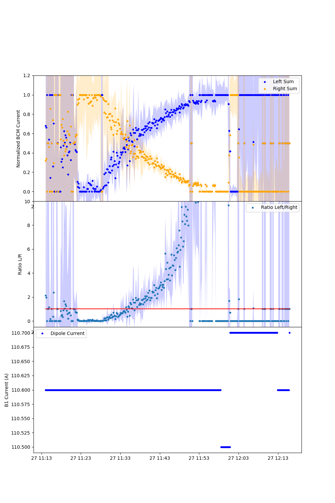

**Beam Centering Monitor (BCM) data analysis for SECAR**

The BCM is used in the SECAR beamline to center the beam. It's made up of four metal plates that are electrically isolated and idependently read current when a beam of particles hits them. The amount of current read is proportional to the amount of beam hitting the plate, and the sum of all four currents is the total amount of beam we are producing.

*This is the analysis code used to visualize the data incoming from Control System Studio (CSS) to aid with centering the beam.*

 
Above image shows the diagnostic devices before installation in beamline. Leftmost device is the BCM.

 **Resulting visuals
 
 
 The top graph in the above image shows the left sum and the right sum of the current as a function of time. 
 
 The plot in the middle shows the ratio of left to right. The beam is centered in the horizontal direction when they ratio is 1 as indicated by the red line. This can be seen as the crossing on the top graph. 
 
 The bottom graph is the value of the dipole current moving the beam as a function of time. In this image, we can see that there is an *error in the recorded data*: the values of the dipole current do not change, while the ratio of left to right is changing, meaning the beam is moving but it *looks* like nothing is making it move. This was later found out to be that the dipole current values were not being archived to the desired precision, and since we were making changes as small as 0.01 A, this did not show in the data. 
 
**NOTE**

After comparing analysis methods, this method of centering the beam has been deemed less preferable, and instead the use of the viewer has been adopted for the time being. Therefore further development of this code (e.g. integration with CSS) was put on hold. Please visit the [viewer analysis repo](https://github.com/pluflou/Viewer-Image-Analysis) for more info!

**Packages needed**:

numpy, matplotlib, pandas, datetime

**How to retrieve the data**:

The method below gives us data that has been averaged of a specified time limit and the errors from the max and min during each time period have been calculated.

1. From the CSS file BCMarchives.plt, select the time range you want and then right-click and go to export.
2. Select the "linear interpolation" option and pick a time limit for the interpolation (5 seconds for example).
3. Select Tabular and check the errors option. Uncheck all else. Exponentials with precision 3 is fine.
4. Select path to where this code is (if running on same machine), name 'BCManalysis' and click Export.

**How to run**

1. Unless the name of the data file is different, run the code immediately with 'python3 bcm_analysis.py'
2. Any changes in the CSS plot will likely cause an error while importing or cause to give you wrong information.

